# Proyecto: Hosting de sitio web estático en Amazon S3

Este proyecto guía paso a paso cómo alojar un sitio web estático utilizando Amazon S3. Aprenderás a crear un bucket, subir archivos, habilitar el hosting, y aplicar políticas de seguridad avanzadas.

<!-- -------------------------------------------------- -->

## Paso 1: Buscar S3 en la consola de AWS

Ingresa a la consola de AWS y busca "S3" en la barra superior.

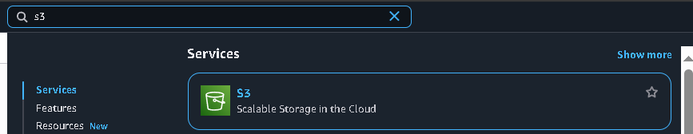
<!-- -------------------------------------------------- -->
Paso 2: Crear un nuevo bucket
<!-- -------------------------------------------------- -->
Haz clic en el botón Create bucket.

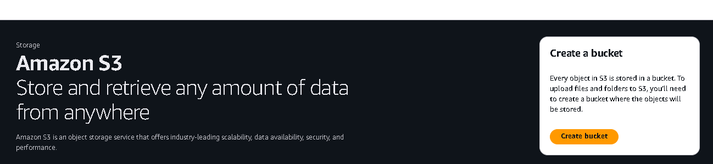
<!-- -------------------------------------------------- -->
Paso 3: Configurar nombre, ACLs y propietario
<!-- -------------------------------------------------- -->
Escribe un nombre para el bucket siguiendo el formato: nextwork-website-project-tu-nombre.
<!-- -------------------------------------------------- -->
Habilita ACLs.
<!-- -------------------------------------------------- -->
Selecciona Bucket owner preferred.
<!-- -------------------------------------------------- -->
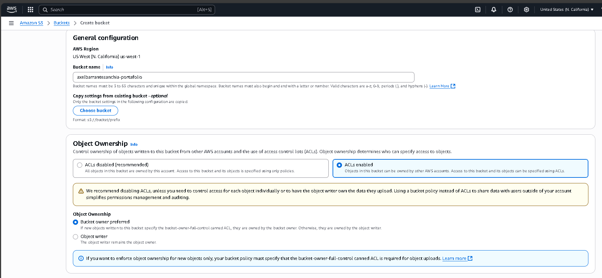
💡 ¿Qué son las ACLs (Access Control Lists)?
<!-- -------------------------------------------------- -->
Son listas de control de acceso que definen qué usuarios o cuentas pueden acceder a objetos específicos dentro del bucket.
<!-- -------------------------------------------------- -->
Paso 4: Configurar acceso público y versionado
<!-- -------------------------------------------------- -->
Desmarca la opción Block all public access.
<!-- -------------------------------------------------- -->
Marca la casilla de confirmación.
<!-- -------------------------------------------------- -->
Activa Bucket Versioning.
<!-- -------------------------------------------------- -->
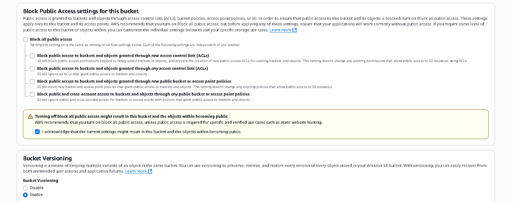
<!-- -------------------------------------------------- -->
Paso 5: Habilitar S3 Encryption y Bucket Key
<!-- -------------------------------------------------- -->
Asegúrate de que esté habilitada la cifrado del lado del servidor (SSE-S3).
<!-- -------------------------------------------------- -->
Activa la opción Bucket Key para reducir costos de cifrado.
<!-- -------------------------------------------------- -->
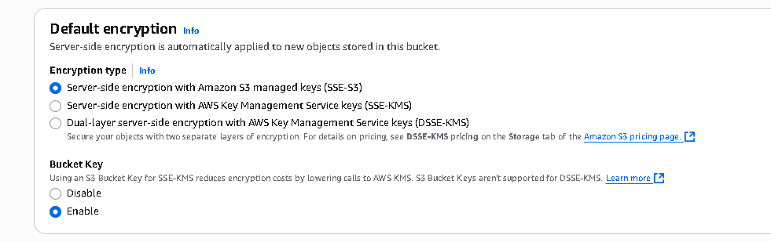
💡 S3 Encryption protege automáticamente tus archivos almacenados en S3 usando claves gestionadas por AWS.
<!-- -------------------------------------------------- -->
💡 Bucket Key permite usar una sola clave del KMS para cifrar múltiples objetos, optimizando costos.

<!-- -------------------------------------------------- -->
Paso 6: Crear el bucket
<!-- -------------------------------------------------- -->
Haz clic en Create bucket para finalizar la creación.
<!-- -------------------------------------------------- -->
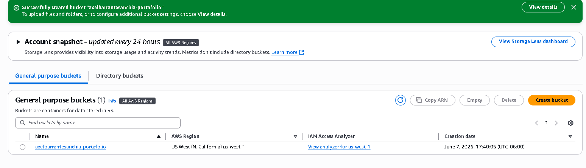
<!-- -------------------------------------------------- -->
Paso 7: Iniciar subida de archivos
<!-- -------------------------------------------------- -->
Entra al bucket recién creado y selecciona Upload.
<!-- -------------------------------------------------- -->
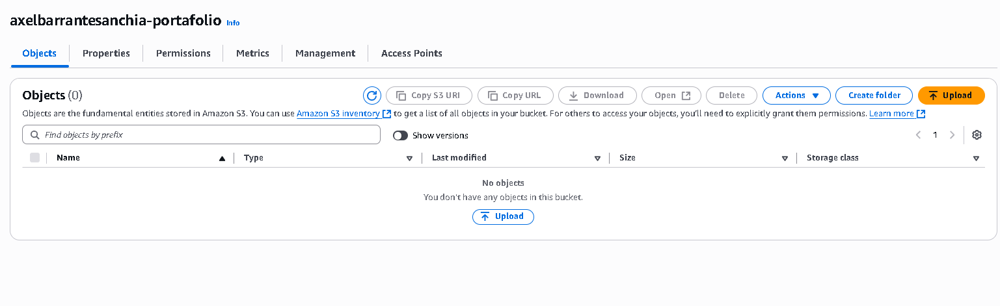
<!-- -------------------------------------------------- -->
Paso 8: Subir archivos HTML
<!-- -------------------------------------------------- -->
Selecciona los archivos index.html y about.html.
<!-- -------------------------------------------------- -->
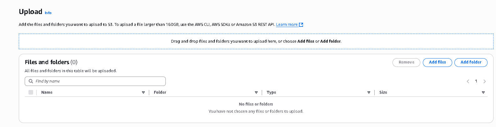
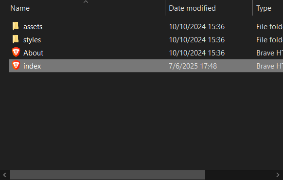

<!-- -------------------------------------------------- -->
Paso 9: Subir carpetas de assets y styles
<!-- -------------------------------------------------- -->
Selecciona las carpetas descomprimidas: assets/ y styles/.
<!-- -------------------------------------------------- -->
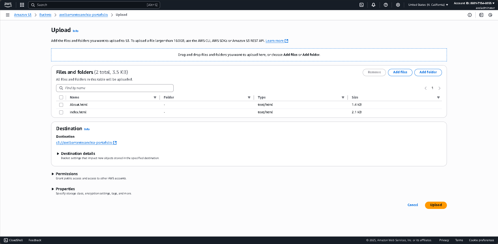

<!-- -------------------------------------------------- -->
Paso 10: Confirmar subida
<!-- -------------------------------------------------- -->
Haz clic en Upload para comenzar la transferencia.
<!-- -------------------------------------------------- -->
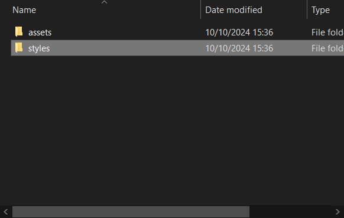

<!-- -------------------------------------------------- -->
Paso 11: Éxito en la subida
<!-- -------------------------------------------------- -->
Verifica el mensaje de éxito: Upload succeeded.
<!-- -------------------------------------------------- -->
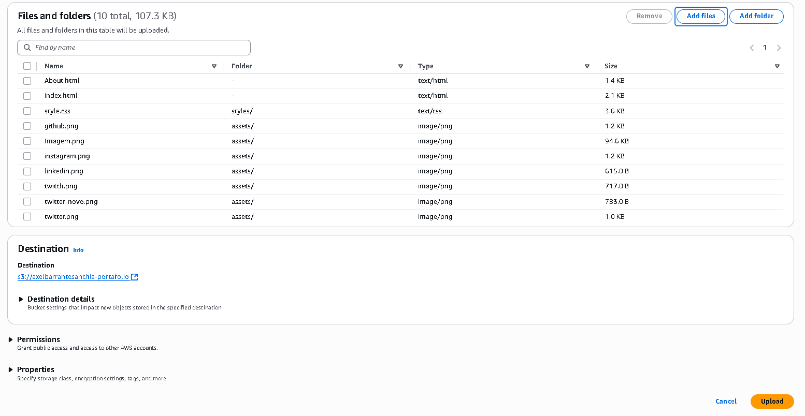
<!-- -------------------------------------------------- -->
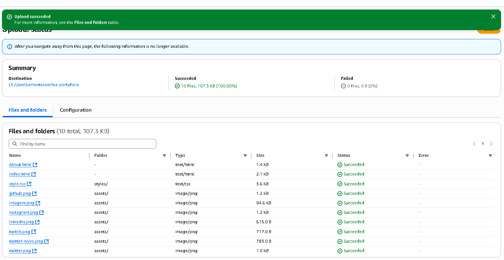
<!-- -------------------------------------------------- -->
Paso 12: Ir a Properties
<!-- -------------------------------------------------- -->
Desde el bucket, haz clic en la pestaña Properties.
<!-- -------------------------------------------------- -->
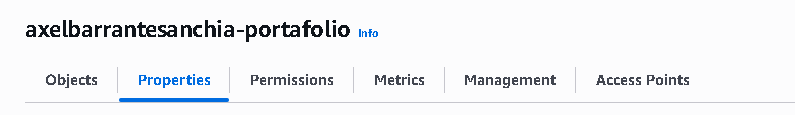
<!-- -------------------------------------------------- -->
Paso 13: Ir a configuración de Static Website Hosting
<!-- -------------------------------------------------- -->
Desplázate hasta la sección Static website hosting y selecciona Edit.
<!-- -------------------------------------------------- -->
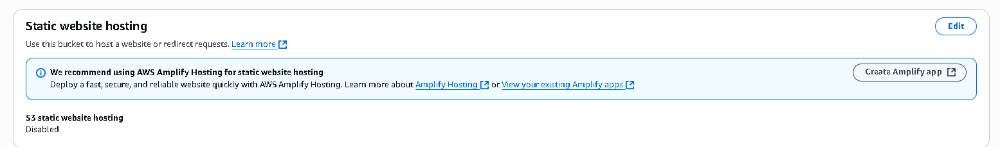
<!-- -------------------------------------------------- -->
Paso 14: Activar hosting de sitio estático
<!-- -------------------------------------------------- -->
Habilita el hosting estático.
<!-- -------------------------------------------------- -->
Elige Host a static website.
<!-- -------------------------------------------------- -->
En Index document, coloca: index.html.
<!-- -------------------------------------------------- -->
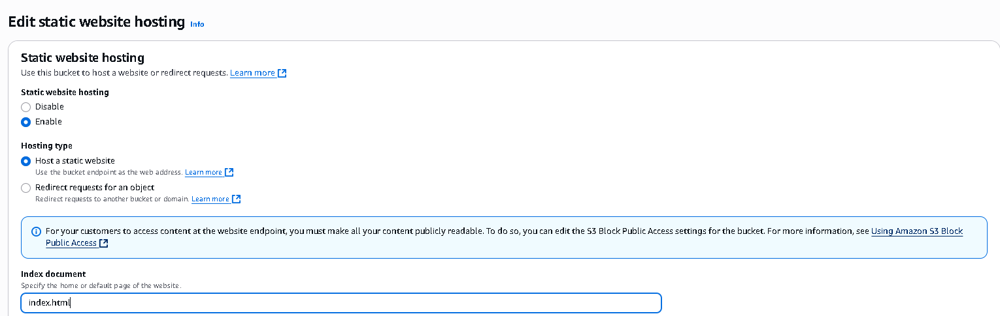
<!-- -------------------------------------------------- -->
Paso 15: Probar el sitio - Error 403
<!-- -------------------------------------------------- -->
Haz clic en el Bucket website endpoint y notarás un 403 Forbidden.
<!-- -------------------------------------------------- -->
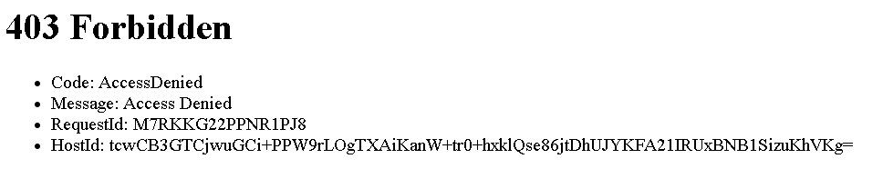
<!-- -------------------------------------------------- -->
💡 Esto ocurre porque los objetos todavía son privados por defecto.

<!-- -------------------------------------------------- -->
Paso 16: Hacer públicos los objetos con ACL
<!-- -------------------------------------------------- -->
Ve a la pestaña Objects, selecciona todos los archivos y carpetas, luego elige Make public using ACL.
<!-- -------------------------------------------------- -->
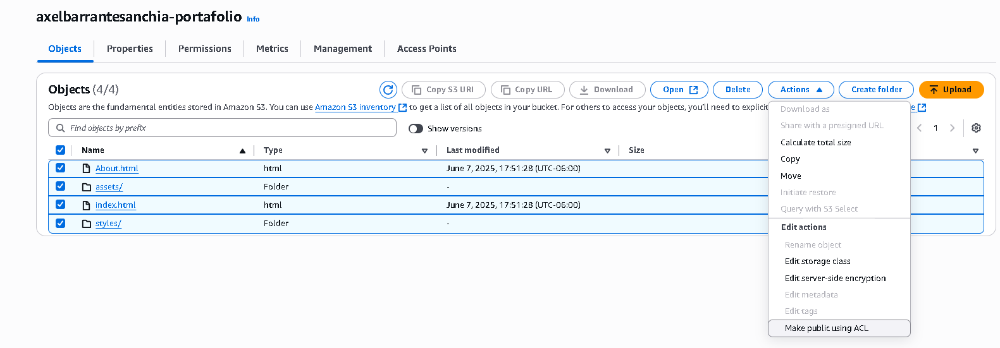
<!-- -------------------------------------------------- -->
💡 ACL vs Bucket Policy
<!-- -------------------------------------------------- -->
ACLs: Controlan acceso a nivel de objeto.
<!-- -------------------------------------------------- -->
Bucket Policies: Se aplican a todo el bucket, y permiten definir reglas más avanzadas.
<!-- -------------------------------------------------- -->
En este caso, usamos ACLs para mostrar cómo dar permisos por objeto.

<!-- -------------------------------------------------- -->
Paso 17: Confirmación de visibilidad
<!-- -------------------------------------------------- -->
Verifica el mensaje de éxito tras hacer los objetos públicos.
<!-- -------------------------------------------------- -->
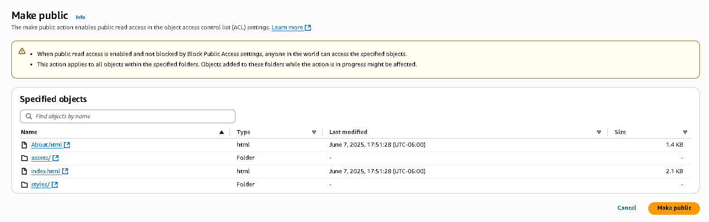
<!-- -------------------------------------------------- -->
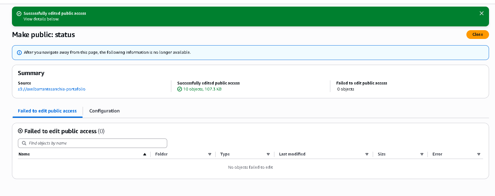
<!-- -------------------------------------------------- -->
Paso 18: Probar nuevamente la página
<!-- -------------------------------------------------- -->
Recarga el enlace del bucket website endpoint. ¡Tu sitio ya está visible!
<!-- -------------------------------------------------- -->
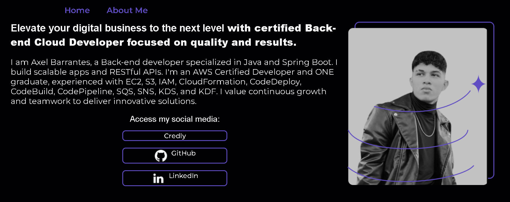
<!-- -------------------------------------------------- -->
Paso 19: Ir a la sección Permissions
<!-- -------------------------------------------------- -->
Haz clic en la pestaña Permissions de tu bucket.
<!-- -------------------------------------------------- -->
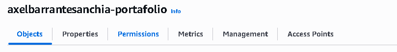
<!-- -------------------------------------------------- -->
Paso 20: Ir a Bucket Policy
<!-- -------------------------------------------------- -->
En Permissions, ve a Bucket Policy y haz clic en el botón para usar el generador de políticas.
<!-- -------------------------------------------------- -->
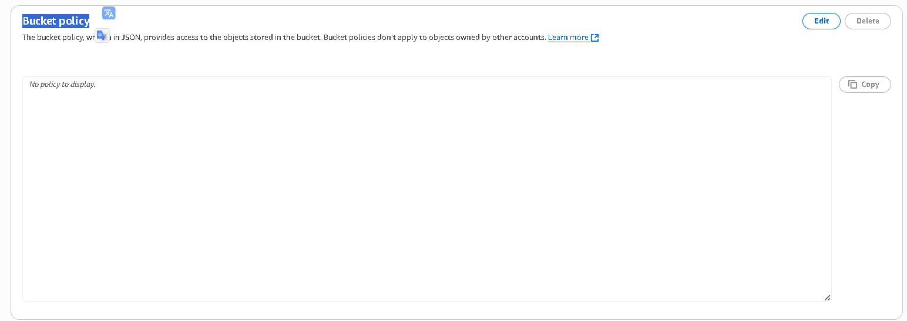
<!-- -------------------------------------------------- -->
Paso 21: Seleccionar tipo de política
<!-- -------------------------------------------------- -->
Selecciona S3 bucket policy como tipo de política en el generador.
<!-- -------------------------------------------------- -->
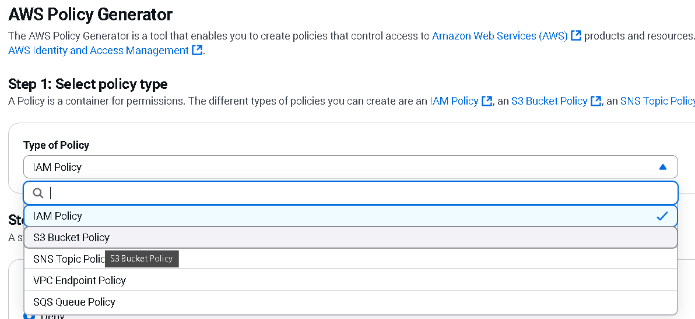
<!-- -------------------------------------------------- -->
Paso 22: Copiar ARN del objeto
<!-- -------------------------------------------------- -->
Puedes copiar el ARN desde Properties o desde la consola del objeto específico.
<!-- -------------------------------------------------- -->
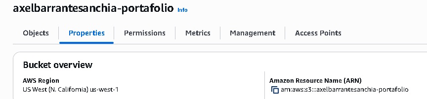
<!-- -------------------------------------------------- -->
Paso 23: Configurar política Deny
<!-- -------------------------------------------------- -->
En el generador, configura los siguientes campos:
<!-- -------------------------------------------------- -->
Effect: Deny
<!-- -------------------------------------------------- -->
Principal: *
<!-- -------------------------------------------------- -->
Action: s3:DeleteObject
<!-- -------------------------------------------------- -->
Resource: arn:aws:s3:::nextwork-website-project-tu-nombre/index.html
<!-- -------------------------------------------------- -->
SID: BucketPutDelete
<!-- -------------------------------------------------- -->

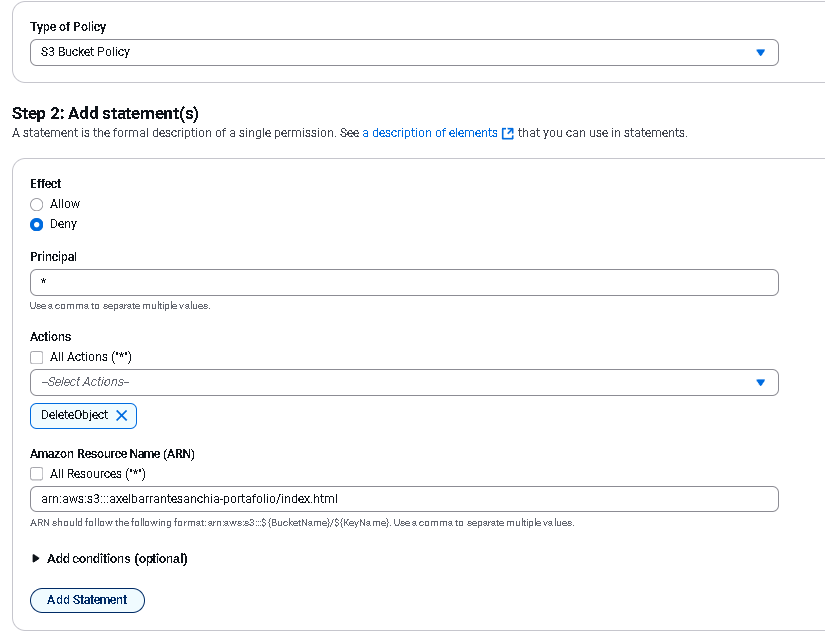
<!-- -------------------------------------------------- -->
Paso 24: Generar la política
<!-- -------------------------------------------------- -->
Haz clic en Add Statement y luego en Generate Policy.
<!-- -------------------------------------------------- -->
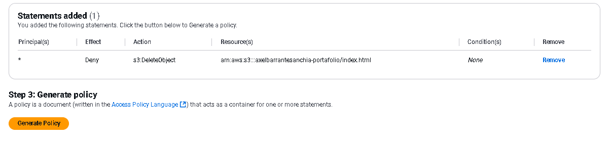
<!-- -------------------------------------------------- -->
Paso 25: Copiar el JSON
<!-- -------------------------------------------------- -->
El generador te mostrará el JSON listo para copiar.
<!-- -------------------------------------------------- -->
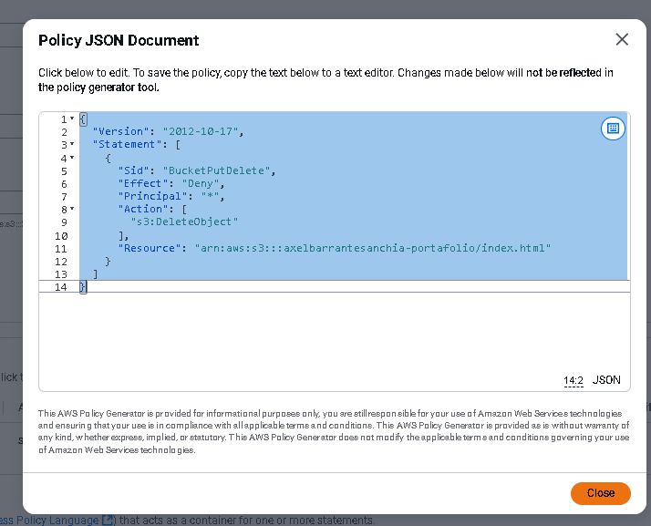
<!-- -------------------------------------------------- -->
Paso 26: Pegar el JSON
<!-- -------------------------------------------------- -->
Pega el JSON en la sección de Bucket Policy en la consola de S3.
<!-- -------------------------------------------------- -->
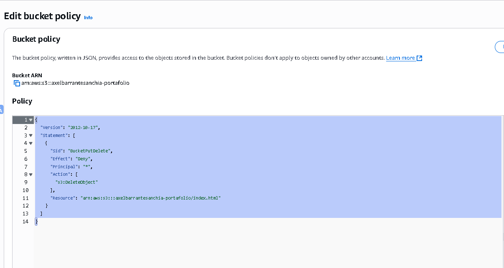
<!-- -------------------------------------------------- -->
Paso 27: Guardar cambios
<!-- -------------------------------------------------- -->
Haz clic en Save changes para aplicar la política.
<!-- -------------------------------------------------- -->
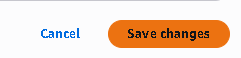
<!-- -------------------------------------------------- -->
Paso 28: Política aplicada con éxito
<!-- -------------------------------------------------- -->
Verifica que aparezca el mensaje de éxito tras aplicar la política.
<!-- -------------------------------------------------- -->
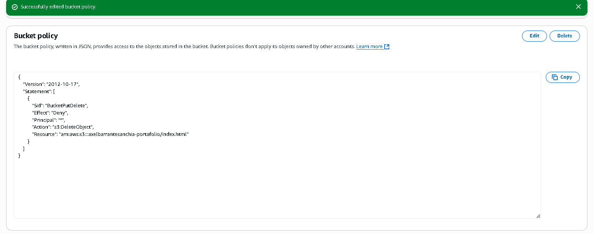
<!-- -------------------------------------------------- -->
Paso 29: Intentar eliminar index.html
<!-- -------------------------------------------------- -->
Intenta eliminar index.html desde la consola. Verás que no es posible, gracias a la política aplicada.
<!-- -------------------------------------------------- -->
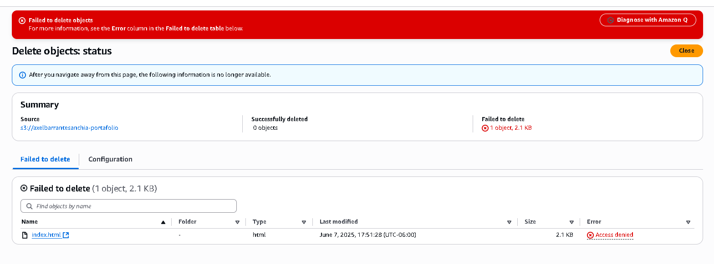

✨ Autor
<!-- -------------------------------------------------- -->
**Axel Andres Barrantes Anchia**
<!-- -------------------------------------------------- -->
📍 Santa Ana, San José
<!-- -------------------------------------------------- -->
📧 [axelbarrantesanchia@gmail.com](mailto:axelbarrantesanchia@gmail.com)
